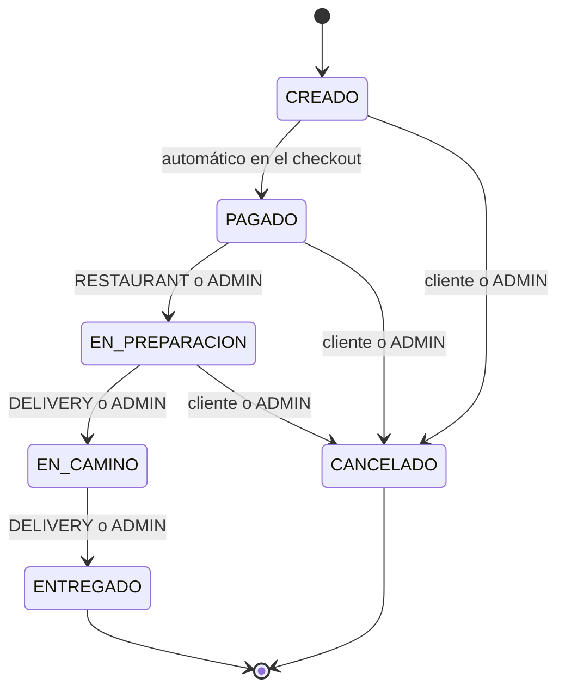

# Módulo de Órdenes (Pedidos)

Guía para el equipo de frontend sobre el checkout y el ciclo de vida de un pedido. El carrito de compras vive completamente en el frontend — este backend solo recibe la lista final de productos en el momento del checkout.

## 1. Resumen

- El cliente arma su carrito en la app y, al confirmar, llama a `POST /orders` con los productos, la cantidad de cada uno, la dirección de entrega y el método de pago.
- El backend valida stock, calcula IVA, descuenta inventario y crea el pedido de forma atómica: o se crea todo, o no se crea nada.
- El pedido avanza por una serie fija de estados (ver diagrama abajo) según quién lo mueva: el restaurante, el repartidor o el propio cliente (para cancelar).

## 2. Entidades

### Order

| Campo | Tipo | Notas |
|---|---|---|
| `id` | `string` (UUID) | |
| `userId` | `string` (UUID) | Cliente dueño del pedido |
| `status` | `OrderStatus` | Ver diagrama de estados |
| `paymentMethod` | `'CARD' \| 'CASH'` | Elegido por el cliente en el checkout |
| `deliveryAddress` | `string` | Texto libre, resuelto por el cliente (GPS o escrito a mano) |
| `items` | `OrderItem[]` | Detalle del pedido |
| `subtotal` | `number` | Suma de `items[].subtotal` |
| `taxAmount` | `number` | `subtotal * 0.13` (IVA) |
| `total` | `number` | `subtotal + taxAmount` |
| `cashCollectedAt` | `string \| null` | Timestamp ISO. **Solo se llena cuando un pedido CASH llega a `ENTREGADO`** (el repartidor cobró en la entrega). Para CARD siempre es `null`. |
| `createdAt` / `updatedAt` | `string` (ISO, hora El Salvador) | |

### OrderItem

Línea de pedido **congelada** en el momento de la compra — el nombre y precio no cambian aunque el producto cambie después.

| Campo | Tipo |
|---|---|
| `id` | `string` (UUID) |
| `productId` | `string` (UUID) |
| `productName` | `string` |
| `unitPrice` | `number` |
| `quantity` | `number` |
| `subtotal` | `number` (`unitPrice * quantity`) |

## 3. Ciclo de vida del pedido



`CREADO` existe solo como transición interna instantánea — al llamar `POST /orders`, el pedido ya vuelve como `PAGADO` en la misma respuesta. No es posible volver a un estado anterior, y **no se puede cancelar después de `EN_CAMINO`** (el repartidor ya salió con el pedido).

### Tabla de transiciones y quién puede dispararlas

| De → A | Quién |
|---|---|
| `CREADO → PAGADO` | Automático (checkout) |
| `PAGADO → EN_PREPARACION` | `ADMIN` o `RESTAURANT` |
| `EN_PREPARACION → EN_CAMINO` | `ADMIN` o `DELIVERY` |
| `EN_CAMINO → ENTREGADO` | `ADMIN` o `DELIVERY` |
| `CREADO/PAGADO/EN_PREPARACION → CANCELADO` | `ADMIN`, o el `CUSTOMER` dueño del pedido |

`PAGADO` **nunca** se puede setear manualmente vía `PATCH /orders/:id/status` — el API lo rechaza con 400. Solo se asigna automáticamente en el checkout.

## 4. Flujo de pago

El cliente elige `paymentMethod` en el body del checkout:

- **`CARD`**: se simula una pasarela de pago (autoriza el cobro internamente) y el pedido pasa a `PAGADO` de inmediato. `cashCollectedAt` queda `null` para siempre en este pedido.
- **`CASH`** (contra entrega): no hay cobro previo — el pedido también pasa a `PAGADO` de inmediato (significa "pedido confirmado", no "dinero en mano"). El dinero se cobra físicamente cuando el repartidor entrega el pedido: en ese momento, al hacer `PATCH /orders/:id/status { "status": "ENTREGADO" }`, el backend **setea `cashCollectedAt` automáticamente**. Esto le sirve al admin para conciliar cuánto efectivo debe rendir cada repartidor.

## 5. Endpoints

Todos bajo el prefijo `/api/v1`. Documentación interactiva completa en `/api-docs` (tag **Orders**).

### `POST /orders`

Checkout. Requiere rol `CUSTOMER`.

```json
// Request
{
  "paymentMethod": "CASH",
  "deliveryAddress": "Colonia Escalón, San Salvador",
  "items": [
    { "productId": "550e8400-e29b-41d4-a716-446655440000", "quantity": 2 }
  ]
}
```

```json
// Response 201
{
  "success": true,
  "statusCode": 201,
  "data": {
    "id": "…",
    "status": "PAGADO",
    "paymentMethod": "CASH",
    "cashCollectedAt": null,
    "subtotal": 10,
    "taxAmount": 1.3,
    "total": 11.3,
    "items": [ { "productName": "Hamburguesa", "unitPrice": 5, "quantity": 2, "subtotal": 10 } ]
  }
}
```

Errores: `400` (items vacío, dirección muy corta, cantidad inválida), `401`, `403` (rol distinto a CUSTOMER), `404` (producto no existe), `409` (stock insuficiente).

### `GET /orders`

Lista pedidos. `CUSTOMER` solo ve los suyos (cualquier `userId` que envíe se ignora); `ADMIN`/`DELIVERY`/`RESTAURANT` ven todos. Soporta `?status=`, `?page=`, `?limit=` con la misma metadata de paginación que `/products`.

### `GET /orders/:id`

El dueño del pedido, o `ADMIN`/`DELIVERY`/`RESTAURANT`. `403` si un cliente intenta ver un pedido ajeno, `404` si no existe.

### `PATCH /orders/:id/status`

Avanza el estado. Body: `{ "status": "EN_PREPARACION" | "EN_CAMINO" | "ENTREGADO" | "CANCELADO" }`.

Errores: `400` (transición inválida, p. ej. saltarse un paso, cancelar tras `EN_CAMINO`, o intentar `PAGADO`), `403` (rol no autorizado para esa transición o cliente cancelando un pedido ajeno), `404`.

## 6. Matriz de roles

| Acción | CUSTOMER | RESTAURANT | DELIVERY | ADMIN |
|---|:---:|:---:|:---:|:---:|
| Checkout (`POST /orders`) | ✅ (propio) | ❌ | ❌ | ❌ |
| Ver sus propios pedidos | ✅ | — | — | — |
| Ver todos los pedidos | ❌ | ✅ | ✅ | ✅ |
| Mover a `EN_PREPARACION` | ❌ | ✅ | ❌ | ✅ |
| Mover a `EN_CAMINO` / `ENTREGADO` | ❌ | ❌ | ✅ | ✅ |
| Cancelar (`CANCELADO`) | ✅ (propio, antes de `EN_CAMINO`) | ❌ | ❌ | ✅ |

## 7. Seguimiento en tiempo real: polling ahora, WebSockets después (roadmap)

**Para el estado del pedido (`status`), usar polling.** El frontend simplemente llama `GET /orders/:id` cada cierto intervalo (por ejemplo cada 5-10 segundos) y compara el `status` recibido contra el que tenía guardado; si cambió, actualiza la UI. Es la técnica correcta aquí porque el estado del pedido cambia pocas veces en toda su vida (4-5 veces en 30-40 minutos) — no se necesita nada más sofisticado, y así se usa el endpoint que ya existe sin código adicional en el backend.

```
Cliente                          Servidor
   │──── GET /orders/123 ───────▶│
   │◀─── { status: "PAGADO" } ───│
   │  (espera unos segundos)
   │──── GET /orders/123 ───────▶│
   │◀─ { status: "EN_PREPARACION" } │  ← cambió, actualiza UI
```

**Para la ubicación del repartidor en un mapa (estilo PedidosYa), se usará WebSockets — no está construido todavía, queda planeado como siguiente fase.** La razón es la frecuencia: una ubicación en un mapa necesita actualizarse cada 2-5 segundos para verse fluida, y hacer eso con polling significaría cientos de peticiones HTTP solo para mover un punto — un desperdicio comparado con una conexión persistente.

Cómo se plantea esa fase futura (diseño, aún no implementado):
1. Mientras el pedido está `EN_CAMINO`, la app del repartidor envía su posición (`lat`/`lng`) por un socket cada pocos segundos.
2. El backend retransmite esa posición solo a los clientes suscritos a ese `orderId` específico (un "room" por pedido, para que un cliente nunca vea la ubicación de un repartidor ajeno).
3. La app del cliente se conecta al socket al abrir la pantalla de seguimiento de su pedido y mueve el marcador en el mapa con cada actualización recibida.
4. Al llegar a `ENTREGADO`, el canal se cierra — ya no hay nada que transmitir.

Esto sería un módulo nuevo (algo como `OrderTrackingSocket`, probablemente con `socket.io` corriendo sobre el mismo servidor HTTP) que se apoya en lo que ya existe (mismo JWT para autenticar la conexión, mismo `orderId`, mismo estado `EN_CAMINO` como disparador) sin necesidad de modificar las entidades, use cases ni endpoints REST descritos en este documento.

## 8. Limitaciones conocidas (fuera de alcance de esta entrega)

- No hay bloqueo de fila (`SELECT ... FOR UPDATE`) a nivel de base de datos durante el checkout — bajo concurrencia extrema dos checkouts simultáneos podrían competir por el mismo stock; para el volumen de este proyecto no representa un riesgo real, pero es la mejora obvia si se lleva a producción.
- Si el cobro simulado con `CARD` fallara después de ya haberse descontado el stock, no hay una compensación automática (no se le regresa el stock al producto). No ocurre en la práctica porque la pasarela simulada siempre autoriza montos positivos, pero quedaría pendiente si en el futuro se integra una pasarela real que sí pueda rechazar cobros.
- No existe "repartidor asignado" a un pedido — cualquier usuario con rol `DELIVERY` puede tomar y mover cualquier pedido en cola.
- No hay seguimiento de ubicación en vivo todavía (ver sección 7) — es la siguiente fase planeada, no parte de esta entrega.
